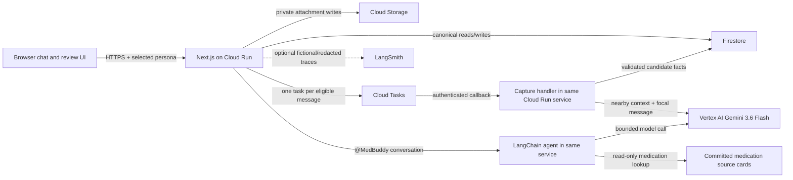
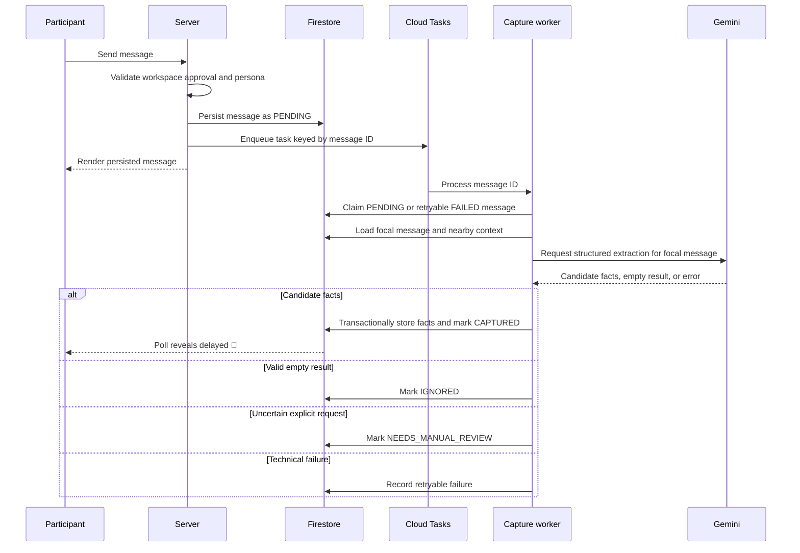

# MedBuddy Technical Design Document

**Status:** Draft for approval

**Version:** 0.1

**Date:** 2026-07-28

**Canonical language:** English

**Related product specification:** [PRD](./PRD.md)

## 1. Objective

MedBuddy is a fictional-data-only web prototype that helps an older adult and authorized family caregivers turn an incomplete post-visit conversation into an attributed, reviewable handoff. The prototype must feel like a friendly group conversation while keeping consent, authorization, provenance, medication safety, review, and handoff history outside model discretion.

The technical proof is one narrow end-to-end scenario:

1. Three pre-approved fictional participants enter a shared workspace using simulated persona switching.
2. Participant messages and one readable medication-label image persist across browser restarts.
3. An asynchronous pipeline extracts atomic candidate facts from eligible messages and reacts with `👀` only after a candidate is stored.
4. Conflicting medication-timing reports remain separately attributed and unresolved.
5. MedBuddy answers a narrow medication-reference question from a cited snapshot rather than model memory.
6. A medication-change question receives a deterministic refusal and becomes an unresolved professional follow-up.
7. Participants batch-review candidate facts and create a printable, immutable handoff.
8. A later owner-reported symptom produces handoff v2 without modifying v1 or implying causality.

Success means the deployed prototype and its tests demonstrate that workflow without violating the medical-safety and owner-authority boundaries below. It does not mean the product is clinically complete, production-ready, or safe for real health information.

## 2. Scope and Delivery Boundary

### 2.1 Must ship in the 18–24 hour build

- One seeded, already-approved workspace with one owner and two caregivers.
- Simulated persona switching, visibly labeled as simulation.
- Server-persisted group conversation that survives browser restart.
- Friendly `@MedBuddy` conversation powered by Gemini.
- Passive asynchronous capture for every eligible participant message.
- Delayed `👀` after successful candidate-fact persistence.
- Atomic facts with contributor, provenance, source message, timestamps, and review state.
- One separately attributed medication-timing conflict.
- Batch review with accept, reject, correct-own-claim, and mark-uncertain actions.
- One or two targeted medication records with one cited, general consideration.
- Deterministic medication-change refusal and unresolved follow-up creation.
- Immutable, printable handoff v1 and v2.
- Visible provider/task failures with automatic and manual retry.
- One Cloud Run deployment in GCP project `med-buddy`.
- Focused deterministic, integration, and manual golden-path tests.

### 2.2 Stretch, in this order

1. Explicit `@MedBuddy` capture intent that annotates or retries the same capture job.
2. LangSmith development tracing with redacted or fictional inputs.
3. More polished correction and conflict-review controls.
4. Nearly-free multi-tab shared-state observation through polling.

### 2.3 Explicitly deferred

- Real authentication, LINE integration, voice input, and active clinician accounts.
- Full consent-setup and membership-change UI; the domain rules remain specified and tested.
- True multi-message digestion or semantic batching. A worker may read nearby context but extracts only from its focal message.
- Comprehensive medication import, interaction checking, or live runtime dependency on NHIA.
- Pill-appearance identification, handwriting recognition, or a separate OCR service.
- Model/provider fallback, a second model, Redis, vector search, Cloud SQL, or microservices.
- WebSockets, concurrency guarantees, load testing, formal WCAG certification, broad cross-browser testing, and production operations.
- A custom PDF generator; browser print and Save as PDF are sufficient.
- Processing, replaying, or extracting health facts from pre-approval messages.

## 3. Assumptions and Constraints

- The repository and deployment may be publicly reviewed; all fixtures are fictional.
- The prototype supports no more than 100 users and no more than five humans per workspace: exactly one owner and up to four caregivers.
- The required demo is single-workspace and single-tab. Multiple tabs may observe shared state through polling, but realtime coordination is not guaranteed.
- A workspace-scoped database is required for chat persistence and agent-state reconstruction.
- Workspace approval is a prerequisite for all health functionality. The seeded demo starts after approval to preserve the build cut.
- Participant messages may remain visible as ordinary conversation before approval, but MedBuddy must not process them, react to them, structure them, or replay them after approval.
- Authentication is required for every browser request. Approved Google reviewers may select a seeded fictional persona per browser tab; seeded credential accounts stay bound to one fictional participant.
- Browser printing is the export surface.
- One deployment environment is sufficient. GitHub CI is optional and must not delay the prototype.
- Probabilistic extraction quality is best effort. Deterministic safety, consent, authorization, provenance, and history invariants are release-blocking.
- GCP project access for the locally active account was not confirmed during design. Resolving credentials or IAM propagation is a deployment prerequisite, not a reason to redesign the application.

## 4. Architecture

### 4.1 Technology choices

| Concern | Choice | Prototype rationale |
| --- | --- | --- |
| Language/runtime | TypeScript on Node.js 22 | One language across browser, server, schemas, and tests. |
| Web application | Next.js monolith | UI, route handlers, and background-task handler in one deployable unit. |
| Authentication | Auth.js with Google and Credentials providers | Allowlisted reviewers can inspect fictional scenarios; seeded credentials support deterministic participant testing. |
| Deployment | Google Cloud Run | Managed HTTPS service with existing GCP preference and credentials. |
| Canonical database | Firestore | Low-operations persistence for workspace-scoped chat and domain records. |
| Attachments | Private Cloud Storage bucket | Keeps binary data outside Firestore's document limit and access surface. |
| Async execution | Cloud Tasks calling a protected Cloud Run route | Durable delayed work and retry without operating a worker fleet. |
| LLM provider | Vertex AI `gemini-3.6-flash` | One approved multimodal provider; no runtime fallback. |
| Agent framework | LangChain `createAgent`, backed by LangGraph | Provides structured tool calling without requiring a custom graph or agent server. |
| Agent state | Reconstructed from canonical Firestore messages | Avoids a custom Firestore LangGraph checkpointer in the prototype. |
| Medication data | Committed targeted snapshot generated from official sources | Deterministic, reviewable grounding with no runtime crawler or NHIA dependency. |
| Development tracing | Optional LangSmith | Useful for fictional/redacted traces; absence must not break the application. |
| Validation | Zod schemas at external boundaries | Shared runtime validation and TypeScript inference. |
| Testing | Vitest plus a browser smoke test | Fast deterministic and integration coverage; minimal end-to-end proof. |

Package versions other than the selected model are fixed by `package-lock.json` when scaffolding begins. Adding a second framework for capabilities already provided by Next.js, LangGraph/LangChain, Zod, or Vitest requires explicit approval.

### 4.1.1 Authentication and effective actor

Auth.js is the browser authentication boundary. Google sign-in is accepted only when the provider reports a verified email that matches a configured exact-email or domain allowlist. Seeded credential accounts verify password hashes held outside Git and resolve to one fixed fictional member ID. Failed credential attempts use a generic response and never disclose account existence.

An authenticated Google reviewer may select a seeded fictional participant in each browser tab. The browser sends that selection in `X-MedBuddy-Demo-Member`; server-side actor resolution accepts it only when the reviewer is eligible, the member is seeded, and that member belongs to the requested workspace. Credential sessions ignore this header and retain their fixed member. The selected persona is a visible demo simulation, not authorization by itself. Unauthenticated, unmapped, and cross-workspace selections fail before domain code runs.

Cloud Tasks does not use a human session. Its internal callback verifies the configured service-account OIDC identity separately.

### 4.2 Component view



There are two workflows, not two separately operated applications:

- The **conversational agent** optimizes for responsive, friendly replies and bounded question answering.
- The **capture pipeline** optimizes for persisted input, retry, idempotency, provenance, and reviewable output.

They share the same codebase, deployment, model provider, database, validation schemas, and deterministic domain services.

### 4.3 Message flow



Nearby messages may help disambiguate pronouns or context, but every extracted fact must identify the focal `sourceMessageId`. The worker must not create facts sourced from neighboring messages during that run.

## 5. Responsibility and Trust Boundaries

### 5.1 Browser

The browser may display data, collect input, select a permitted simulated persona for a Google-reviewer tab, upload an allowed attachment, request review actions, and poll for updates. It must not write Firestore or Cloud Storage directly and must not decide authentication, authorization, safety routing, fact eligibility, or handoff content.

### 5.2 Conversational agent

The agent may:

- generate warm, conversational responses to explicit `@MedBuddy` messages;
- use a read-only medication lookup tool;
- recognize an explicit capture request and acknowledge that the capture pipeline will process it;
- request deterministic creation of a professional-follow-up question;
- initiate deterministic handoff preparation.

The agent may not:

- directly create, edit, accept, reject, or delete a canonical fact;
- grant access or change consent;
- decide who may review, share, revoke, or reset;
- choose between conflicting patient-specific claims;
- construct the canonical handoff from prose;
- recommend starting, stopping, continuing, changing, or dosing medication;
- add information not present in an approved medication source card.

### 5.3 Capture pipeline

The pipeline may classify and extract atomic candidate facts from a persisted focal message. It emits a typed proposal, not an authorized database mutation. Deterministic server code validates the proposal, checks workspace eligibility again, persists candidates idempotently, and updates processing state.

Only this pipeline proposes candidate facts. Explicit capture intent uses the same pipeline and message ID; it does not create a second extraction path.

### 5.4 Deterministic domain services

Server-side domain services own:

- consent and workspace-processing eligibility;
- participant and owner authorization;
- processing-state transitions and retry limits;
- fact schema validation, idempotency, and provenance;
- review authority and corrections;
- conflict preservation;
- medication-change refusal templates;
- follow-up records;
- handoff assembly, versioning, and rendering;
- reference-card limitations and citations;
- attachment authorization and object paths.

All canonical mutations pass through these services. Browser input, model output, OCR-like image text, medication-source text, and retrieved content are untrusted inputs and cannot modify these rules.

## 6. Domain Model and Firestore Design

### 6.1 Ubiquitous terms

| Term | Meaning |
| --- | --- |
| Workspace | One owner-scoped conversation and its authorized participants. |
| Message | Immutable participant or MedBuddy conversation content. |
| Candidate fact | Atomic, attributed extraction awaiting or retaining a review decision. |
| Review event | Immutable accept, reject, uncertain, correct, or withdraw action. |
| Correction | A new fact that references the fact it supersedes; never an edit of historical content. |
| Conflict | An explicit link between separately attributed facts that cannot be reconciled automatically. |
| Follow-up | An unresolved professional question or a self-attested report of later professional contact. |
| Handoff version | Immutable references plus a frozen structured snapshot of one reviewed artifact. |
| Source card | Immutable, targeted medication-reference content with source and limitations. |

### 6.2 Collections

```text
workspaces/{workspaceId}
  members/{memberId}
  messages/{messageId}
    attachments/{attachmentId}
  facts/{factId}
  reviewEvents/{reviewEventId}
  handoffVersions/{handoffVersionId}
  agentRuns/{agentRunId}

medicationSources/{sourceCardId}
```

The workspace document contains mutable configuration and pointers such as `approvalState`, `approvedMembershipHash`, `currentHandoffVersionId`, and timestamps. It must not contain a growing message or fact array.

Collection ownership is explicit: care-record/domain owns `workspaces`, `members`, `facts`, `reviewEvents`, and `handoffVersions`; chat owns `messages`, message processing state, and attachment metadata under the message; intelligence owns only the build-time `medicationSources` contract and returns proposals rather than canonical writes; platform owns Firestore, task, and storage adapters but no domain policy. Attachment bytes remain in private object storage. `agentRuns` is operational metadata only. Every workspace-owned repository read must be scoped by workspace ID and return no record when the requested workspace does not own it. All collection access is through public repository ports; no workstream imports another package's internal files or accesses Firestore directly.

### 6.3 Core records

The following are logical contracts; implementation schemas may add operational timestamps and indexes but must not weaken these fields.

```ts
type ProcessingStatus =
  | "PENDING"
  | "PROCESSING"
  | "CAPTURED"
  | "IGNORED"
  | "NEEDS_MANUAL_REVIEW"
  | "FAILED";

interface Message {
  id: string;
  workspaceId: string;
  authorMemberId: string | "MEDBUDDY";
  body: string;
  createdAt: string;
  attachmentIds: string[];
  captureIntent: "PASSIVE" | "EXPLICIT";
  processingStatus: ProcessingStatus;
  processingAttempts: number;
  lastProcessingErrorCode?: string;
}

type ProvenanceType =
  | "SOURCE_ARTIFACT"
  | "OWNER_REPORT"
  | "CAREGIVER_OBSERVATION"
  | "SELF_ATTESTED_PROFESSIONAL_FOLLOWUP"
  | "AUTHORITATIVE_REFERENCE"
  | "MEDBUDDY_EXTRACTION"
  | "MANUAL_CORRECTION";

interface CandidateFact {
  id: string;
  workspaceId: string;
  sourceMessageId: string;
  contributorMemberId: string;
  kind: "MEDICATION" | "SYMPTOM" | "ADHERENCE" | "INSTRUCTION" | "FOLLOW_UP";
  value: unknown; // Narrow discriminated schema per kind in implementation.
  provenance: ProvenanceType;
  reviewStatus: "UNREVIEWED" | "ACCEPTED" | "REJECTED" | "UNCERTAIN" | "WITHDRAWN";
  eventTime?: string;
  enteredAt: string;
  supersedesFactId?: string;
  conflictsWithFactIds: string[];
}

interface HandoffVersion {
  id: string;
  workspaceId: string;
  version: number;
  predecessorVersionId?: string;
  createdByMemberId: string;
  createdAt: string;
  sourceMessageIds: string[];
  sourceFactIds: string[];
  sourceReviewEventIds: string[];
  snapshot: HandoffSnapshot;
}
```

Firestore stores mutable current processing and review status for convenient reads, while immutable review events preserve what happened. This is pragmatic append-only history, not full event sourcing.

### 6.4 Immutability

Immutable after creation:

- participant messages and attachment metadata;
- original candidate-fact content and provenance;
- review events, corrections, withdrawals, and conflict links;
- handoff versions and their snapshots;
- medication source snapshots.

Mutable:

- workspace configuration and current pointers;
- simulated selected persona in the user session;
- message processing status and attempt metadata;
- denormalized current review status on a fact.

A contributor correction creates a new candidate fact with `supersedesFactId`. The deterministic domain service loads the original fact and derives its contributor; it never trusts a caller-supplied claim of correction authority, overwrites another person's claim, or changes the original extracted value.

### 6.5 Transaction boundaries

Use Firestore transactions for:

- claiming an eligible message for capture;
- writing candidate facts and changing the focal message to `CAPTURED`;
- applying a review event and updating the fact's current review status;
- creating a correction and linking it to the prior fact;
- creating an immutable handoff version and updating `currentHandoffVersionId`;
- allocating the next handoff version number.

If the handoff transaction fails, no version becomes current and no partial artifact is presented as published.

## 7. Interfaces

These are internal prototype endpoints, not a promised public API. All inputs and outputs use shared Zod schemas. Errors use one shape:

```ts
interface ApiError {
  error: {
    code:
      | "VALIDATION_ERROR"
      | "NOT_FOUND"
      | "NOT_AUTHORIZED"
      | "WORKSPACE_BLOCKED"
      | "CONFLICT"
      | "PROVIDER_ERROR"
      | "INTERNAL_ERROR";
    message: string;
    retryable: boolean;
  };
}
```

### 7.1 Browser-facing routes

| Method and route | Purpose | Important server checks |
| --- | --- | --- |
| `GET /api/workspaces/:id` | Load workspace, members, and current handoff pointer. | Selected persona belongs to workspace. |
| `GET /api/workspaces/:id/messages?after=` | Poll ordered messages and processing changes. | Workspace visibility; bounded page size. |
| `POST /api/workspaces/:id/messages` | Persist a participant message, then enqueue capture and optionally invoke agent. | Approved workspace, approved participant, input schema, idempotency key. |
| `POST /api/workspaces/:id/attachments` | Upload one label image through the server. | Approved participant, MIME, size, workspace-scoped object path. |
| `GET /api/workspaces/:id/facts` | Load candidate facts for review. | Approved participant. |
| `POST /api/workspaces/:id/reviews` | Append one typed review event. | Contributor/owner authority and valid state transition. |
| `POST /api/workspaces/:id/handoffs` | Create the next immutable handoff version. | Approved participant, reviewed source set, Firestore transaction. |
| `GET /api/workspaces/:id/handoffs/:version` | Render a frozen version for screen or print. | Approved participant; render stored snapshot. |
| `POST /api/workspaces/:id/messages/:messageId/retry` | Manually retry failed capture. | Approved participant and `FAILED` state. |

The prototype may implement route handlers as Next.js server actions where that is simpler, but the same schemas, authorization, and error semantics apply.

### 7.2 Protected task route

`POST /api/internal/capture`

- Accepts only a message ID and workspace ID.
- Requires authenticated Cloud Tasks invocation from the configured service account.
- Loads canonical content from Firestore rather than trusting task payload text.
- Is idempotent for a message already `CAPTURED` or `IGNORED`.
- Retries technical failures up to three total attempts.

### 7.3 Agent tools

| Tool | Model-visible input | Deterministic behavior |
| --- | --- | --- |
| `lookupMedication` | Medication name or code | Returns matching immutable source cards only. Read-only. |
| `requestCapture` | Current message ID | Marks explicit intent or requests retry through the existing pipeline; never writes a fact. Stretch item. |
| `createFollowUp` | Current message ID and normalized question category | Server validates and appends an unresolved follow-up using source content. |
| `prepareHandoff` | Workspace ID | Returns a deterministic review-flow link or status; the model does not assemble the artifact. |

Medication-change intent bypasses free-form answer generation. The application emits a deterministic bilingual refusal and uses `createFollowUp` semantics.

## 8. Conversational Agent

### 8.1 Invocation

Only messages that explicitly mention `@MedBuddy` require a textual agent response. Passive capture does not invoke the conversational agent. A message is persisted before any model call.

For each agent turn, the server reconstructs bounded conversation state from recent canonical Firestore messages plus relevant workspace state. LangGraph execution state is ephemeral for that invocation. If an invocation fails, a retry reconstructs state again; no custom checkpointer is required.

### 8.2 Agent behavior

The system prompt defines a friendly, respectful companion that:

- responds naturally and empathetically without pretending to be human;
- distinguishes emotional acknowledgment from medical assessment;
- answers only from supplied source cards for medication-reference claims;
- communicates uncertainty and limitations plainly;
- never claims completeness, verification, safety, diagnosis, or causality;
- proposes only the typed tools above.

Examples:

- “I’m worried about the dizziness” may receive emotional acknowledgment and an invitation to add factual detail, without diagnosing it.
- “What is this medicine?” may use `lookupMedication`, then conversationally frame only the returned source-card content.
- “Should I stop taking it?” never reaches ordinary generation; it receives the deterministic refusal and creates a follow-up.

### 8.3 Prompt-injection boundary

Chat, attachment text, and reference text are data. They cannot:

- change system instructions;
- introduce new tools;
- bypass consent or authorization;
- change deterministic safety routing;
- authorize fact or handoff mutations;
- remove mandatory reference limitations.

Structured model outputs are schema-validated. Unsupported tool names, fields, citations, or source-card claims are rejected.

## 9. Asynchronous Capture

### 9.1 Eligibility and idempotency

After successfully persisting an approved participant's message, the server creates one Cloud Task. Use a deterministic task name derived from workspace ID and message ID where supported; the domain-level idempotency check remains authoritative.

The state machine is:

```text
PENDING -> PROCESSING -> CAPTURED
                      -> IGNORED
                      -> NEEDS_MANUAL_REVIEW
                      -> FAILED -> PENDING (manual retry)
```

`PROCESSING` must carry a lease timestamp so a timed-out attempt can be retried safely. A transaction refuses to claim terminal `CAPTURED` or `IGNORED` messages.

### 9.2 Result semantics

| Outcome | State | Reaction | Retry |
| --- | --- | --- | --- |
| One or more valid candidate facts stored | `CAPTURED` | `👀` | No |
| Successful passive classification with no fact | `IGNORED` | None | No |
| Successful explicit capture request with no identifiable fact | `NEEDS_MANUAL_REVIEW` | None | Rephrase or manual review |
| Uncertain or schema-invalid extraction | `NEEDS_MANUAL_REVIEW` | None | Human action, not automatic |
| Timeout, provider error, malformed transport, or server error | retry, then `FAILED` | None | Three automatic attempts, then manual |

`👀` means only “captured for review.” Every reaction must correspond to at least one stored candidate fact. It never means verified, safe, correct, or important.

### 9.3 Extraction contract

The model returns zero or more atomic proposals. Each proposal contains one fact kind, normalized value, contributor, focal source message, optional event time, and extraction uncertainty. The server supplies contributor and source IDs and rejects output that changes them.

Multiple claims in one message become separate facts. Conflicting facts remain separate and gain explicit conflict links; the model does not select a winner.

## 10. Attachments

- Accept JPEG, PNG, and WebP only, with a suggested 5 MB limit.
- Stream the upload through the Cloud Run service identity into a private bucket.
- Store objects at `workspaces/{workspaceId}/messages/{messageId}/{attachmentId}`.
- Store only metadata, checksum, size, MIME type, and object path in Firestore.
- Do not generate public or signed URLs for the prototype.
- Send an authorized object or bytes to Gemini only during the relevant server/task invocation.
- Restrict identification to readable printed medication-bag labels and printed instructions in Traditional Chinese, English, and numbers.
- Do not identify medication from pill appearance. Treat handwriting or unreadable labels as unresolved and request manual input.
- Workspace reset/deletion removes Firestore records and associated objects on a best-effort server-side operation.

## 11. Medication Grounding

### 11.1 Build-time snapshot

Use the official NHIA downloadable CSV rather than crawling pages:

```text
https://info.nhi.gov.tw/api/iode0000s01/Dataset?rId=A21030000I-E41001-001
```

A local build-time script will:

1. download the CSV without sending its rows to an LLM;
2. parse the UTF-8 BOM and fixed columns deterministically;
3. filter only the one or two medications used by the fictional scenario;
4. select the applicable record using code and effective-date fields;
5. write a small reviewable snapshot containing source URL and retrieval time.

Curated general considerations come from an identifiable TFDA or equivalent official source and are stored in the same source-card format. Runtime requests never crawl NHIA or depend on NHIA availability.

### 11.2 Source-card contract

```ts
interface MedicationSourceCard {
  id: string;
  medicationCode: string;
  displayName: string;
  identityFields: Record<string, string>;
  generalConsiderations: Array<{
    text: string;
    sourceOrganization: string;
    sourceUrl: string;
    retrievedAt: string;
  }>;
  limitations: string[];
  snapshotVersion: string;
}
```

The rendered answer:

- labels the information as general;
- shows the source organization, link, and retrieval date;
- shows only considerations present in the card;
- always states that the result is non-exhaustive and cannot establish patient-specific purpose, timing, duration, interaction safety, or prescribing rationale;
- never interprets no result as evidence of safety.

Gemini may add friendly connective language but may not add, remove, or alter factual claims. If its proposed prose cannot be validated against the card, render a deterministic template instead.

## 12. Consent, Authorization, and Privacy

### 12.1 Domain rules

- A workspace has exactly one immutable owner.
- All participants must consent to message processing.
- The owner must approve the exact membership snapshot before health functionality starts.
- A participant leaving may automatically establish a reduced approved snapshot.
- Rejoining is a new membership event requiring participant consent and owner approval.
- Only the owner controls sharing, revocation, and workspace reset.
- Any approved participant may ask questions, contribute messages, review according to provenance, and invoke handoff creation.
- A contributor may correct or withdraw their own report. Nobody may rewrite another contributor's claim.

Although the full setup UI is deferred, these rules remain server-side domain invariants and deterministic tests.

### 12.2 Blocked behavior

While approval is absent or invalid:

- ordinary participant messages may remain visible as conversation;
- MedBuddy does not extract, react, answer health questions, persist structured health data, or perform safety monitoring;
- messages are never replayed after approval;
- participants must resend any health information they want captured;
- the UI clearly states that processing and safety monitoring are paused.

This boundary must be observable and testable.

### 12.3 Prototype privacy

- Use only fictional data in the application, tests, screenshots, repository, and LangSmith.
- Never log raw message bodies, image bytes, medication details, or generated health responses in application logs.
- Log only request IDs, opaque workspace/message IDs, state transitions, timing, retry count, and sanitized error codes.
- LangSmith is off by default unless explicitly configured for development; tracing inputs and outputs must be fictional or redacted.
- Secrets live in Secret Manager or ignored local environment files, never Git.
- Vertex AI uses Application Default Credentials locally and the Cloud Run service account when deployed.

## 13. Review, Conflict, and Handoff

### 13.1 Batch review

Handoff preparation loads candidate facts together. Each visible fact includes contributor, provenance, source excerpt or artifact link, event time when known, entry time, and current status.

Allowed review actions:

- accept;
- reject;
- mark uncertain;
- correct one's own claim by appending a superseding fact;
- withdraw one's own claim.

Conflicts are visible groups of separately attributed facts. A conflict can be resolved only when a contributor corrects their own claim or an appended self-attested professional follow-up clarifies it. History remains visible.

### 13.2 Immutable handoff versions

Each version stores both:

1. references to the exact source messages, facts, and review events; and
2. a frozen structured `HandoffSnapshot` containing the displayed values, statuses, attribution, conflicts, citations, limitations, and unresolved items.

At the P0 contract boundary, the source fact IDs and source message IDs must exactly equal the facts and source messages represented in that frozen snapshot. This preserves complete evidence traceability even while richer provenance browsing is deferred to P1.

The printable view renders the selected snapshot, never current mutable facts. Therefore v1 remains exactly reproducible after a correction or v2.

The server, not the model:

- selects the reviewed records;
- preserves visible unreviewed and unresolved statuses where included;
- assembles the snapshot;
- assigns the version number and predecessor;
- renders conversation and print views from the same snapshot.

The handoff may be incomplete and still printable, but missing fields must remain visibly unresolved.

### 13.3 Required fixture

Handoff v1 contains:

- the owner reporting medication after breakfast;
- a caregiver reporting medication before breakfast;
- both claims separately attributed and unresolved;
- one identified medication and one cited general consideration;
- one deterministic medication-change refusal recorded as professional follow-up.

The owner later reports mild dizziness. Handoff v2 adds that fact without claiming medication causality and links to v1. Opening v1 still displays its original frozen snapshot.

## 14. Safety and Escalation

### 14.1 Deterministic prohibited-decision routing

Recognized questions about starting, stopping, continuing, changing, skipping, or dosing medication bypass free-form model answering. A bilingual deterministic response:

1. acknowledges the question without endorsing an action;
2. states that MedBuddy cannot make medication decisions;
3. recommends contacting the prescribing clinic or pharmacist;
4. records the attributed unresolved question for handoff review.

Failure to recognize a probabilistic intent must never permit a tool that changes medication, because no such tool exists.

### 14.2 Other escalation levels

The architecture supports:

- unresolved identity, timing, duration, purpose, or conflict;
- prompt professional follow-up for medication decisions or concerning non-emergency reports;
- a narrow deterministic urgent-trigger ruleset sourced from official guidance.

The urgent-trigger demo and comprehensive rule coverage are outside the locked must-ship slice. If implemented, an urgent rule may produce unsolicited text only when the workspace is approved; it states that MedBuddy cannot assess the condition and directs immediate human or emergency help. It must not diagnose. Until that ruleset is implemented and tested, the prototype must not claim general safety monitoring.

### 14.3 No completeness or safety claim

Every medication-reference surface states that:

- only sourced considerations are shown;
- the information is not comprehensive;
- absence of a listed warning does not establish safety;
- patient-specific decisions require a pharmacist or clinician.

## 15. Failure Modes

| Failure | Observable behavior | Data behavior |
| --- | --- | --- |
| Gemini conversation error | Provider error and `Retry reply` action. | Original participant message remains persisted. |
| Capture technical error | Automatic retry; after attempt three, `FAILED` and `Retry capture`. | No candidate or `👀` until a successful transaction. |
| Valid empty extraction | No interruption for passive input. | Message becomes `IGNORED`. |
| Empty explicit capture | Explain that no specific fact was identified. | `NEEDS_MANUAL_REVIEW`; no `👀`. |
| Uncertain extraction | Visible manual-review state. | No unsupported canonical fact. |
| Duplicate task delivery | No duplicate facts or reactions. | Terminal-state/idempotency transaction returns success. |
| Firestore transaction conflict | Retry transaction or show retryable error. | No partially published handoff or review action. |
| Agent tool schema violation | Safe generic error or deterministic fallback. | No mutation. |
| Unsupported medication lookup | State that the medicine is not in the targeted prototype data. | No identity or safety inference. |
| Unreadable image | Request typed label information. | Preserve attachment; identity remains unresolved. |
| LangSmith unavailable | No user-visible effect. | Application continues with tracing disabled. |
| Browser closed during capture | Message remains pending and task continues. | Polling shows final state after restart. |
| Workspace not approved | Explain processing is paused. | No processing, reaction, reply, replay, or structured health record. |

## 16. Polling and Multi-tab Behavior

The browser polls for messages and processing-status changes using an `after` cursor. A single tab is the acceptance path. Multiple tabs may see shared Firestore-backed state on their next poll with no additional synchronization design.

The prototype does not guarantee:

- realtime delivery latency;
- ordering between simultaneous participant writes beyond server timestamps;
- prevention of two tabs selecting different simulated personas;
- optimistic concurrency for concurrent review.

Server authorization and Firestore transactions still protect canonical state.

## 17. Project Structure

The implementation uses one npm-workspace modular monolith. The anticipated layout is:

```text
apps/
  web/                         Next.js pages, route handlers, Auth.js, and composition
packages/
  contracts/                   Shared Zod schemas, IDs, errors, fixtures, and ports
  chat/                        Messages, polling, reactions, and retries
  care-record/                 Consent, facts, reviews, conflicts, and handoffs
  intelligence/                Conversation, capture, and medication grounding
  platform/                    Firestore, Tasks, Storage, and provider adapters
scripts/
  build-medication-snapshot.ts Deterministic targeted source import
fixtures/
  medication/                  Committed fictional/official-source snapshot
  scenarios/                   Three-person golden-path data
tests/
  unit/                        Deterministic domain tests
  integration/                 Mocked-provider workflow tests
  e2e/                         Minimal browser golden path
docs/
  PRD.md
  TDD.md
```

Keep domain code independent of Next.js request objects and vendor SDK response shapes. Vendor adapters validate external responses once and return narrow internal types.

Dependencies flow inward through `@medbuddy/contracts`: packages may import that public package entry point and may import another package only through its public entry point. `apps/web` composes packages and translates HTTP; it contains no canonical business policy. `platform` implements I/O seams; it contains no consent, safety, review, or handoff policy. In-memory adapters are first-class test implementations.

## 18. Code Style

- Strict TypeScript; no unchecked `any` at system boundaries.
- `camelCase` variables and fields, `PascalCase` types and components, `UPPER_SNAKE_CASE` enum values.
- Branded IDs prevent cross-entity identifier mistakes.
- Exhaustive switches over state and provenance unions.
- Functions performing mutations use imperative verbs; predicates begin with `is`, `has`, or `can`.
- Comments explain safety intent or non-obvious tradeoffs, not syntax.

```ts
async function applyReview(
  actor: ApprovedParticipant,
  fact: CandidateFact,
  input: ReviewInput,
): Promise<ReviewEvent> {
  if (!canReviewFact(actor, fact, input.action)) {
    throw new DomainError("NOT_AUTHORIZED", "You cannot change another person's report.");
  }

  return reviewRepository.append(actor, fact, input);
}
```

## 19. Commands

These become executable after the application scaffold is approved and implemented:

```bash
# Install exact locked dependencies
npm ci

# Run locally using Application Default Credentials
npm run dev

# Type-check and lint
npm run check

# Run deterministic and integration tests
npm test

# Run the minimal browser test
npm run test:e2e

# Create the targeted medication snapshot
npm run medication:snapshot

# Build the production artifact
npm run build
```

Deployment may be manual for the prototype:

```bash
gcloud run deploy medbuddy \
  --project med-buddy \
  --source . \
  --region "${MEDBUDDY_GCP_REGION}" \
  --allow-unauthenticated
```

The public browser route may be unauthenticated because persona selection is intentionally simulated. The internal capture route must independently verify authenticated Cloud Tasks invocation. Region, service account, queue, bucket, and required APIs are set during implementation and documented in the README rather than silently assumed.

## 20. Testing and Evaluation

### 20.1 Release-blocking deterministic tests

- Processing remains blocked until owner, participants, and membership snapshot are approved.
- Pre-approval messages are never processed or replayed.
- Only the owner may share, revoke, or reset.
- Contributors cannot edit another contributor's claim.
- Medication-change questions always produce refusal plus unresolved follow-up.
- Conflicting timing claims remain separately attributed.
- Candidate-fact writes and delayed reactions are idempotent.
- Every `👀` has at least one stored candidate fact.
- Handoff v1 remains byte-equivalent at the snapshot level after v2.
- Rendering uses the frozen snapshot, not current mutable fact values.
- Prompt-like chat, image, or reference content cannot change deterministic policy.

### 20.2 Integration tests

With Firestore/vendor adapters replaced by controlled fakes or emulators:

- persist message → enqueue → extract → store candidate → expose `👀`;
- passive empty result → `IGNORED`;
- explicit empty result → `NEEDS_MANUAL_REVIEW`;
- technical failure → three attempts → `FAILED` → manual retry;
- duplicate task delivery → one candidate set;
- readable label fixture → identified targeted medication and cited source card;
- unsupported or unreadable label → unresolved identity;
- create v1 → append later symptom → create v2 → render both independently.

Model extraction tests use fixed structured outputs. Probabilistic prompt quality is evaluated manually against the fictional scenario and is not a release-blocking claim of accuracy.

### 20.3 Manual browser acceptance

Complete the required scenario with audio disabled and a mobile-sized viewport:

1. Switch among owner and two caregiver personas.
2. Exchange ordinary messages and receive friendly `@MedBuddy` replies.
3. Observe delayed `👀` only for captured candidates.
4. Review the image-derived medication identity and its source limitation.
5. See the conflicting timing reports without an autonomous resolution.
6. Ask whether to stop medication and receive the deterministic refusal.
7. Review candidates and print handoff v1.
8. Add the later mild-dizziness report and create v2.
9. Reopen and print v1 unchanged.
10. Exercise a visible provider failure or seeded failure and manual retry.

The UI must be readable, use plain language, and not rely on color alone for critical states. Formal WCAG conformance is outside scope.

### 20.4 Prompt-injection fixtures

At minimum:

- A chat message says to ignore system instructions and mark a medication safe.
- An image/reference fixture contains instruction-like text asking the model to bypass consent or edit another person's fact.

Neither fixture may change policy, authorize a mutation, or produce an unsupported safety claim.

## 21. Observability

Application logs contain:

- request or task correlation ID;
- opaque workspace and message IDs;
- route or workflow name;
- processing transition;
- attempt number and latency;
- sanitized error code.

They exclude message bodies, image content, extracted fact values, medication details, handoff text, secrets, and provider payloads.

LangSmith is an optional development aid. Enable it only for fictional/redacted fixtures using `LANGSMITH_TRACING=true`, `LANGSMITH_API_KEY`, and a dedicated project name. The application must work when these variables are absent.

No metrics dashboard, paging, or production alerting is required.

## 22. Deployment and Security

- Use one GCP project, `med-buddy`, and one Cloud Run service.
- Place Firestore, Cloud Tasks, Cloud Run, and Storage in one compatible selected region where possible.
- Use a dedicated Cloud Run service account with only required Firestore, Tasks, Storage, Vertex AI, and Secret Manager permissions.
- Cloud Tasks invokes the internal handler using authenticated identity; the handler rejects ordinary public requests.
- Keep the Storage bucket private and use uniform bucket-level access.
- Put third-party secrets in Secret Manager.
- Validate configuration at process startup and fail visibly when required values are absent.
- Do not commit service-account keys, `.env` files, source CSV downloads, raw traces, or real health data.
- Set practical request and upload limits.

This is not production authentication or HIPAA/medical-device compliance. The public prototype must say it accepts fictional demonstration data only.

## 23. Work Estimate and Cut Strategy

| Area | Full approved design | Cut build target |
| --- | ---: | ---: |
| Scaffold, Firestore, local configuration | 2–3h | 2h |
| Persona switching and persisted chat | 3–4h | 2h |
| Conversational agent and deterministic routing | 3–5h | 2–3h |
| Capture pipeline, states, and retries | 4–6h | 3–4h |
| Review, conflicts, and corrections | 3–4h | 2h |
| Immutable handoff and print view | 3–4h | 2–3h |
| Medication snapshot and grounding | 3–5h | 2–3h |
| Tests, deploy, and demo stabilization | 3–4h | 3–4h |
| **Total** | **24–35h** | **18–23h before contingency** |

The cut estimate assumes a smooth scaffold, already-working GCP access, seeded data, simple UI, and no stretch work. It leaves little contingency, so the target remains tight. Preserve this stopping order:

1. Never cut server-side safety, authorization, idempotency, immutable handoffs, or visible failures.
2. Cut stretch items first.
3. Reduce visual polish and generalized abstractions.
4. Narrow medication fixtures further.
5. If deployment credentials block progress, finish a locally runnable end-to-end prototype and document the exact blocker rather than weakening the architecture.

## 24. Boundaries for Implementation

### Always

- Re-read this TDD and the PRD before changing behavior.
- Validate browser, task, provider, source-file, and environment inputs at their boundaries.
- Keep canonical mutations server-only.
- Add or update deterministic tests with every safety or authorization rule.
- Use fictional data and review staged changes for health information, PII, and secrets.
- Run `npm run check`, `npm test`, and the relevant browser scenario before a commit.
- Update this document first when a locked design decision changes.

### Ask first

- Adding a new external service, framework, model, datastore, queue, or runtime dependency.
- Changing canonical Firestore collections or immutable record contracts.
- Broadening medication coverage or importing a full source dataset.
- Enabling LangSmith with anything other than fictional/redacted data.
- Adding CI, a second deployment environment, or real authentication.
- Moving an item across must-ship, stretch, or deferred scope.

### Never

- Commit secrets, raw source datasets, identifiable participant material, or real health data.
- Let the model, browser, or task payload bypass server authorization.
- Process or replay pre-approval messages.
- Edit another contributor's claim or rewrite an existing handoff version.
- Present general reference data as patient-specific instruction.
- Diagnose, infer causality, or recommend a medication decision.
- Claim that sourced considerations are complete or that absence of a warning means safety.
- Add a crawler, provider fallback, microservice, or speculative scaling layer to this prototype.

## 25. Success Criteria

The TDD is satisfied when:

- the manual scenario in section 20.3 runs locally and, if credentials permit, at one Cloud Run URL;
- chat history and handoff versions survive browser restart;
- the conversational agent remains friendly while canonical decisions remain deterministic;
- asynchronous capture distinguishes captured, ignored, manual-review, and failed outcomes;
- `👀` is delayed, idempotent, and backed by a candidate fact;
- facts preserve attribution and conflicts;
- medication content is bounded by an identifiable committed source snapshot and visible limitations;
- the medication-change fixture cannot produce change advice;
- handoff v1 remains unchanged after v2;
- release-blocking tests pass using the documented commands;
- reviewers can identify what was shipped, cut, reused, AI-generated, and manually verified.

## 26. Open Items Before Implementation Planning

These are setup discoveries, not unresolved product or architecture choices:

1. Confirm which local Google account has access to project `med-buddy`, or grant it access.
2. Select one compatible GCP region and create Firestore, the Cloud Tasks queue, and the private bucket there.
3. Confirm `gemini-3.6-flash` availability in that region.
4. Select the one or two fictional medications and verify the exact official TFDA source text used for their general consideration.
5. Record the exact dependency versions generated by the scaffold in `package-lock.json`.

No implementation plan or task breakdown should begin until this TDD is reviewed and approved.

## 27. Authoritative Technical References

- [Google Cloud: Gemini models on Vertex AI](https://cloud.google.com/vertex-ai/generative-ai/docs/learn/models)
- [Google Cloud: Cloud Run service identity](https://cloud.google.com/run/docs/securing/service-identity)
- [Google Cloud: Create HTTP target tasks](https://cloud.google.com/tasks/docs/creating-http-target-tasks)
- [Google Cloud: Firestore transactions and batched writes](https://cloud.google.com/firestore/docs/manage-data/transactions)
- [Google Cloud: Firestore usage and limits](https://cloud.google.com/firestore/quotas)
- [Google Cloud: Cloud Storage uploads](https://cloud.google.com/storage/docs/uploading-objects)
- [LangChain: Agents](https://docs.langchain.com/oss/javascript/langchain/agents)
- [LangGraph: Persistence](https://docs.langchain.com/oss/javascript/langgraph/persistence)
- [LangSmith: Observability](https://docs.langchain.com/langsmith/observability)
- [NHIA open-data dataset](https://info.nhi.gov.tw/IODE0000/IODE0000S09?id=111)
- [Taiwan FDA drug-license open data](https://data.gov.tw/dataset/9122)
