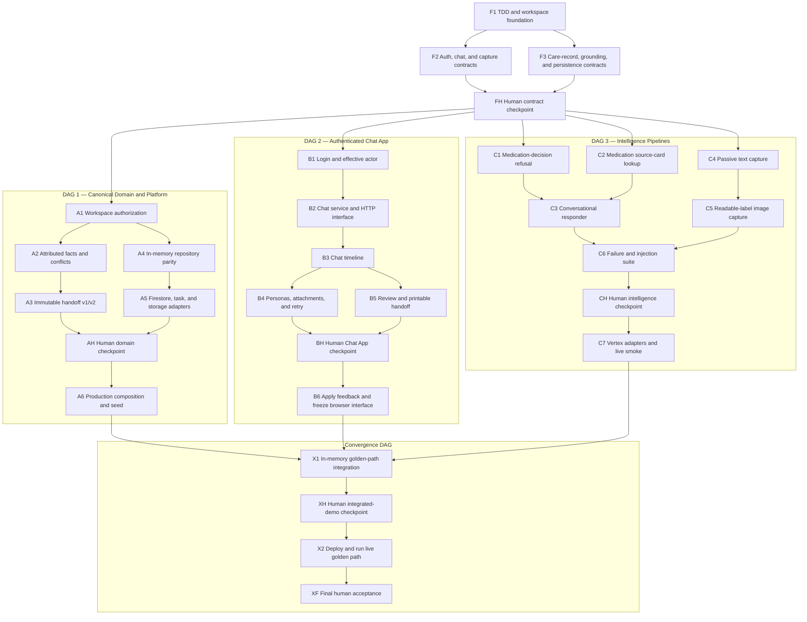

# MedBuddy Parallel Execution Plan

**Status:** Approved for future execution

**Date:** 2026-07-28

**Source design:** [`docs/TDD.md`](../docs/TDD.md), V0 commit `5aea2ca`

## 1. Purpose and Session Boundary

This document turns the approved MedBuddy V0 design into a parallel implementation strategy. It is an execution plan, not authorization to begin implementation.

This planning session creates and commits only:

- `tasks/plan.md`
- `tasks/todo.md`

Do not create application code, install dependencies, provision GCP resources, or alter the TDD during this session. Implementation begins only after separate approval.

## 2. Superseding Authentication Decision

The authentication decision below supersedes the V0 TDD statements that real authentication is deferred, the public browser is unauthenticated, and a selected persona alone identifies the actor:

- Use Auth.js with Google and Credentials providers.
- Permit Google login only for verified emails matching configured email or domain allowlists.
- On first eligible Google prototype-reviewer sign-in, provision one persistent dedicated fictional workspace from the committed golden-scenario template; later sign-ins reuse its mapping.
- Allow an approved Google prototype reviewer to select any seeded fictional participant independently in each browser tab.
- Send that selection as `X-MedBuddy-Demo-Member`; server-side actor resolution accepts it only for an eligible Google prototype reviewer and a seeded member.
- Bind each seeded credential account to exactly one fictional participant. Ignore persona-selection headers from credential accounts.
- Store only password hashes in Secret Manager or ignored local configuration.
- Permit an explicit idempotent reset of only the authenticated prototype reviewer's fictional demo workspace. The reset provisions a replacement and never rewrites the old workspace or handoffs.
- Provide no registration, password reset, account management, or public-user workflow.
- Use service-account OIDC—not human credentials—for Cloud Tasks invocation.

Updating the TDD to record this decision is the first implementation task and must precede application work.

## 3. Architecture

Build one modular monolith with one npm-workspace lockfile, one Next.js application, and one Cloud Run deployment. Parallelism comes from stable module interfaces and replaceable adapters, not independently deployed services.

```text
apps/
  web/
    app/                       Next.js pages and thin route handlers
    src/auth/                  Auth.js configuration and actor resolution
    src/composition/           In-memory and production wiring

packages/
  contracts/                   Zod schemas, branded IDs, errors, fixtures
  chat/                        Messages, polling, reactions, retries
  care-record/                 Facts, reviews, conflicts, handoffs
  intelligence/               Conversation, capture, image analysis, grounding
  platform/                    Firestore, Vertex, Tasks, Storage, auth adapters

fixtures/
  scenarios/                   Fictional three-participant workflow
  medication/                  Targeted official-source snapshots

scripts/                       Seed and medication-snapshot utilities
tests/integration/             Cross-module workflow tests
tests/e2e/                     Authenticated browser golden path
infra/                         GCP setup and deployment notes
tasks/                         Plan and executable checklist
```

Dependency direction:

```text
                         contracts
                   ↗        ↑        ↖
                chat    care-record   intelligence
                   ↖        ↑        ↗
                    platform adapters
                           ↑
                        apps/web
```

Rules:

- Every module may import `contracts`.
- Modules import only another module's public package entry point, never its internal files.
- `apps/web` performs composition and HTTP translation; it contains no canonical business policy.
- `platform` implements I/O seams; it contains no consent, safety, review, or handoff policy.
- In-memory adapters are first-class test implementations, not disposable mocks.

## 4. Module Interfaces and Ownership

### 4.1 Public interfaces

The serial contract gate defines these interfaces before parallel work begins:

```ts
interface ChatService {
  appendMessage(
    actor: ActorContext,
    input: AppendMessageInput,
  ): Promise<AppendMessageResult>;

  listMessages(
    actor: ActorContext,
    query: MessageCursorQuery,
  ): Promise<MessagePage>;

  requestCaptureRetry(
    actor: ActorContext,
    messageId: MessageId,
  ): Promise<void>;
}

interface ConversationResponder {
  respond(input: ConversationRequest): Promise<ConversationResult>;
}

interface ConversationRequest {
  actor: ActorContext;
  messageId: MessageId;
  context: ConversationContext; // bounded canonical messages from Chat
}

interface DemoWorkspaceProvisioner {
  getOrCreate(accountId: AccountId): Promise<DemoWorkspaceMapping>;
  reset(input: DemoWorkspaceResetInput): Promise<DemoWorkspaceMapping>;
}

interface CaptureProcessor {
  process(input: CaptureJobInput): Promise<CaptureOutcome>;
}

interface CareRecordService {
  applyReview(
    actor: ActorContext,
    input: ReviewInput,
  ): Promise<ReviewEvent>;

  createHandoff(
    actor: ActorContext,
    input: CreateHandoffInput,
  ): Promise<HandoffVersion>;
}

interface MedicationGrounding {
  lookup(query: MedicationQuery): Promise<MedicationSourceCard[]>;
}
```

All request, result, event, error, Firestore-document, task-payload, and model-proposal types have Zod schemas in `packages/contracts`. Types are inferred from schemas rather than re-declared in each module.

### 4.2 Data ownership

| Data | Owning module | Canonical writer |
| --- | --- | --- |
| Workspaces and members | Care record/domain | Server-side domain service |
| Messages and message processing state | Chat | `ChatService` and narrow capture-state port |
| Candidate facts and conflict links | Care record | `CareRecordService` |
| Review events and corrections | Care record | `CareRecordService` |
| Handoff versions | Care record | Transactional handoff assembler |
| Medication source cards | Intelligence/grounding | Build-time snapshot script |
| Attachments | Chat metadata; platform object storage | Server-side upload flow |
| Reviewer demo-workspace mappings | Auth/composition | Persistent account-to-fictional-workspace mapping; platform only adapts storage |
| Agent and capture proposals | Intelligence | Never canonical until validated |

The intelligence module does not write Firestore. It returns typed proposals. Care-record code validates and persists facts; chat code updates processing state and exposes `👀`.

### 4.3 Chat and intelligence flow

1. `ChatService` validates the effective actor and persists the human message.
2. Chat dispatches `{workspaceId, messageId}` to capture.
3. Capture reloads canonical text, attachments, and nearby context by ID.
4. Capture returns a typed focal-message result.
5. Care-record code validates and stores candidate facts idempotently.
6. Chat marks the message `CAPTURED` and exposes `👀` only after that transaction succeeds.
7. When the message mentions `@MedBuddy`, Chat constructs bounded `ConversationContext` from canonical messages in that workspace and invokes `ConversationResponder`.
8. The response is appended through the same server-side message writer used for all MedBuddy messages.

The Chat workstream uses fixed adapters for steps 2–8. The intelligence workstream tests those interfaces without a browser or Firestore.

## 5. Serial Contract Gate

The contract gate is the only blocking foundation. One owner completes and merges it before the three implementation streams branch.

Deliverables:

- Root npm workspace and one authoritative lockfile.
- Shared TypeScript, lint, and Vitest configuration.
- Branded identifiers and schemas for auth, chat, capture, facts, provenance, reviews, handoffs, grounding, and errors.
- Valid and invalid fixtures for the complete fictional scenario.
- Public module interfaces and in-memory adapter contracts.
- Firestore collection/document schemas and ownership.
- Updated TDD authentication and modular-monolith sections.

Contract-change policy after the gate:

1. Change `packages/contracts` first.
2. Prefer additive optional fields.
3. Update shared fixtures.
4. Run every affected module suite.
5. Merge the contract change before dependent code.
6. Never bypass a mismatch with direct Firestore access or an internal-file import.

Estimated elapsed time: **1–2 hours**.

## 6. Parallel Workstreams

### Stream 1: Canonical domain and platform

Owns:

- `packages/care-record`
- `packages/platform`
- Firestore schemas and repository adapters
- Cloud Tasks and Cloud Storage adapters
- seed/configuration scripts
- final production composition and deployment

Delivers:

- consent and effective-actor authorization;
- atomic fact validation and provenance;
- review authority, conflict preservation, corrections, and supersession;
- immutable reference-plus-snapshot handoffs;
- in-memory and Firestore repository adapters;
- idempotent task dispatch and authenticated callbacks;
- private attachment storage;
- GCP configuration and deployment.

Independent completion evidence:

- Domain suite runs with no Next.js, Gemini, or GCP dependency.
- The same repository contract tests pass for in-memory and emulator adapters.
- Duplicate task delivery cannot create duplicate facts or reactions.
- Handoff v1 remains snapshot-identical after v2.

Estimated focused effort: **6–8 hours**.

### Stream 2: Authenticated Chat App

Owns:

- `packages/chat`
- browser-facing `apps/web` pages and route handlers
- authentication UI and effective-actor resolution

Delivers:

- Google and seeded credential login;
- first-sign-in provisioning and explicit reset of a Google prototype reviewer's fictional demo workspace through the public contract;
- per-tab fictional persona selection for eligible Google prototype reviewers;
- timeline, composer, attachment input, polling, reactions, and retry controls;
- review and printable handoff screens;
- fixed conversation and capture adapters for isolated development;
- readable mobile-sized presentation.

Independent completion evidence:

- The complete browser flow runs in in-memory mode without GCP or Gemini.
- Human and fixed MedBuddy messages use the same message contract.
- Credential sessions remain bound to their configured participants.
- Separate Google prototype-reviewer tabs may select separate fictional personas in that reviewer's workspace.
- Critical states have readable text and non-color indicators.

Estimated focused effort: **6–8 hours**.

### Stream 3: Intelligence pipelines

Owns:

- `packages/intelligence`
- model and image fixtures
- medication snapshot tooling

Delivers:

- friendly `@MedBuddy` conversation;
- passive text and readable-label image capture;
- nearby context with focal-message-only extraction;
- targeted medication grounding;
- deterministic medication-change refusal;
- captured, empty, uncertain, and failed outcomes;
- Vertex AI and fixed-output adapters.

Independent completion evidence:

- All pipeline tests run headlessly without browser or Firestore.
- Model output cannot authorize or persist canonical state.
- Passive empty results produce `IGNORED`.
- Explicit empty results produce `NEEDS_MANUAL_REVIEW`.
- Injection fixtures cannot change policy, tools, attribution, or safety text.
- Medication responses contain only source-card facts and mandatory limitations.

Estimated focused effort: **6–8 hours**.

## 7. Integration and Merge Sequence

Use separate `codex/` branches and worktrees. After the contract gate, workstreams must avoid editing files owned by another stream.

1. Merge the contract/foundation PR.
2. Branch all three workstreams from that merged commit.
3. Merge Stream 1 pure domain and in-memory adapters.
4. Merge Stream 2 Chat App operating with fixed adapters.
5. Merge Stream 3 intelligence modules operating with fixtures.
6. Merge Stream 1 production Firestore, Tasks, Storage, and Vertex composition.
7. Create one integration PR wiring production adapters.
8. Deploy and execute the golden path.

Checkpoints:

| Checkpoint | Required proof |
| --- | --- |
| A: Contract gate | Contract tests, package boundaries, and fixtures pass. |
| B: Independent modules | Chat works with fakes; intelligence works headlessly; care record works in memory. |
| C: Cross-module | Message → capture → fact → `👀` → review → handoff v1 passes. |
| D: External adapters | Emulator tests and one live provider/storage/task smoke test pass. |
| E: Deployed scenario | Three authenticated tabs complete v1/v2 and v1 remains unchanged. |

The integration owner resolves composition issues through public interfaces. A failing integration must not be “fixed” by moving policy into route handlers or by letting intelligence write canonical records.

## 8. Authentication Implementation

Use Auth.js with Google and Credentials providers.

Configuration:

- `ALLOWED_GOOGLE_EMAILS`: normalized comma-separated exact emails.
- `ALLOWED_GOOGLE_DOMAINS`: normalized comma-separated domains.
- `TEST_USERS_JSON`: Secret Manager/local secret containing username, password hash, and fixed `memberId`.
- Auth.js session secret and Google OAuth client credentials remain outside Git.

`ActorContext` includes:

- authenticated account ID;
- authentication method;
- effective workspace member ID;
- whether the account may assume a demo persona.

Resolution:

- Google: require a verified allowed email; accept `X-MedBuddy-Demo-Member` only for a seeded member in the requested workspace.
- Credentials: resolve the fixed member ID from configuration and ignore the demo-member header.
- Cloud Tasks: authenticate separately through service-account OIDC.
- Unauthenticated or unmapped requests fail before domain invocation.

Deliberately deferred:

- signup, reset, email verification, account administration;
- general multi-tenant account provisioning;
- advanced abuse detection, lockout, or malicious-user hardening.

Still mandatory:

- hashed passwords;
- secure HTTP-only sessions;
- server-side authorization;
- boundary validation and upload limits;
- generic login errors;
- bounded authentication attempts;
- secret and health-data hygiene.

## 9. Test Strategy

### Contract tests

- Parse all shared valid fixtures.
- Reject invalid IDs, states, task payloads, model proposals, and error responses.
- Ensure Firestore records and HTTP shapes use the same canonical schemas.

### Module-interface tests

- Exercise only public module interfaces.
- Inject in-memory repositories and fixed remote adapters.
- Assert observable results rather than internal method calls.

### Adapter contract tests

- Define one reusable behavior suite per repository or dispatcher seam.
- Run it against in-memory and emulator implementations.
- Add one minimal live smoke test per external service after emulator coverage.

### Authentication tests

- Exact email and domain allowlists.
- Rejection of unverified or unlisted Google emails.
- Credential password verification and fixed-member binding.
- Google persona-header validation.
- Credential persona-header rejection.
- Unauthenticated request rejection.

### Safety and pipeline tests

- Medication-change refusal and follow-up proposal.
- Passive and explicit empty-result distinction.
- Three technical attempts and manual retry.
- Focal-message-only extraction.
- Prompt injection through chat and image content.
- Source-only medication response and mandatory limitations.

### Integration and browser tests

- Persist message → capture → fact → `👀` → review → handoff.
- Duplicate task idempotency.
- Provider error and visible retry.
- Three authenticated tabs with separate credential accounts.
- Google prototype reviewer with independent per-tab personas.
- Image attachment and targeted medication grounding.
- Print v1, create v2, reopen unchanged v1.

## 10. Definition of Done

Every task must satisfy its acceptance criteria and:

- run its focused tests;
- keep regression tests passing;
- pass typecheck, lint, and build once those commands exist;
- be runtime-verified through its public interface;
- include no unrelated refactor;
- include no secrets, PII, real health information, raw source datasets, or raw traces;
- update public interfaces and architectural documentation when behavior changes;
- remain within the assigned module ownership;
- receive human approval before merge or deployment.

## 11. Estimates and Critical Path

| Phase | Elapsed target | Parallelism |
| --- | ---: | --- |
| Contract gate | 1–2h | Serial |
| Three module streams | 6–8h | Three-way parallel |
| Cross-module integration | 2–3h | Primarily integration owner |
| External adapters/deployment | 2–3h | Stream 1 with smoke-test support |
| Golden-path stabilization | 2–3h | Coordinated |
| **Optimistic elapsed total** | **13–19h** | Assumes three active implementers/agents |

These are elapsed estimates, not summed labor. GCP permissions, Google OAuth configuration, model availability, and first-time framework setup are the main contingency risks.

## 12. Risks and Mitigations

| Risk | Impact | Mitigation |
| --- | --- | --- |
| Shared schemas change during parallel work | High rework | Merge and freeze the contract gate first; require contract-first changes. |
| “Modular” code becomes pass-through layers | Medium complexity | Keep public interfaces small; put policy in deep owning modules. |
| Chat begins depending directly on Gemini | High coupling | Use `ConversationResponder`; Chat tests only against a fixed adapter. |
| Intelligence writes Firestore directly | High safety risk | Return typed proposals; care record remains canonical writer. |
| Firestore schemas become shared-edit hotspots | High merge risk | Assign collection ownership and use repository interfaces. |
| Auth expands beyond prototype needs | Medium schedule risk | No signup, password reset, account management, or public-user workflow; only allowlisted Google, seeded credentials, and explicit reviewer-demo workspace reset. |
| Google OAuth setup blocks UI work | Medium | Develop Stream 2 with fixed credential/in-memory mode first. |
| GCP IAM or region blocks deployment | High | Complete local in-memory and emulator proof; document exact blocker. |
| Live model output is unstable | Medium | Fixed-output tests are release-blocking; live quality remains manual. |
| Time runs short | High | Cut stretch work, polish, and generalized medication coverage first. |

## 13. Assumptions

- Three implementation workstreams are available concurrently.
- One modular monolith and one deployment remain sufficient.
- In-memory adapters provide the principal development seam.
- Only fictional data is used.
- Credential accounts support both human testing and AI-driven browser verification.
- Multiple tabs observe shared data through polling; realtime synchronization is not required.
- Deterministic safety, authorization, provenance, idempotency, and immutable history are never traded for schedule.
- Implementation starts only after separate approval of these committed planning artifacts.

## 14. GitHub Issue DAG

The implementation is published as a shared contract gate, three independent workstream DAGs, and a convergence DAG. The three workstream DAGs have no edges to one another: they depend only on the external contract gate and meet only after their terminal tickets complete.

Human checkpoint tickets gather feedback after five or six implementation tickets in each workstream. They block subsequent work so feedback can change direction before additional scope is built.



### 14.1 Foundation gate

| Key | Ticket | Blocked by |
| --- | --- | --- |
| F1 | Establish the documented workspace foundation | None |
| F2 | Publish auth, chat, and capture contracts | F1 |
| F3 | Publish care-record, grounding, and persistence contracts | F1 |
| FH | Human checkpoint: approve the contract gate | F2, F3 |

### 14.2 DAG 1: Canonical domain and platform

| Key | Ticket | Blocked by |
| --- | --- | --- |
| A1 | Enforce approved-workspace authority | FH |
| A2 | Review attributed facts without rewriting contributors | A1 |
| A3 | Preserve immutable handoff v1 and v2 | A2 |
| A4 | Run canonical behavior through in-memory persistence | A1 |
| A5 | Prove Firestore, task, and attachment adapter parity | A4 |
| AH | Human checkpoint: validate domain history and persistence | A3, A5 |
| A6 | Compose the production platform and fictional seed | AH |

### 14.3 DAG 2: Authenticated Chat App

| Key | Ticket | Blocked by |
| --- | --- | --- |
| B1 | Authenticate reviewers and fixed test participants | FH |
| B2 | Send and retrieve conversation messages | B1 |
| B3 | Use the persisted Chat App | B2 |
| B4 | Switch demo personas and handle attachments and retries | B3 |
| B5 | Review facts and print immutable handoffs | B3 |
| BH | Human checkpoint: evaluate the complete fake-backed Chat App | B4, B5 |
| B6 | Apply Chat App feedback and freeze its interface | BH |

### 14.4 DAG 3: Intelligence pipelines

| Key | Ticket | Blocked by |
| --- | --- | --- |
| C1 | Refuse medication decisions deterministically | FH |
| C2 | Answer from bounded medication source cards | FH |
| C3 | Respond conversationally without exceeding grounded facts | C1, C2 |
| C4 | Extract atomic facts from passive text | FH |
| C5 | Extract facts from readable medication labels | C4 |
| C6 | Contain provider failures and prompt injection | C3, C5 |
| CH | Human checkpoint: evaluate conversation and extraction | C6 |
| C7 | Connect approved intelligence behavior to Vertex AI | CH |

### 14.5 Convergence DAG

| Key | Ticket | Blocked by |
| --- | --- | --- |
| X1 | Complete the in-memory MedBuddy golden path | A6, B6, C7 |
| XH | Human checkpoint: review the integrated prototype | X1 |
| X2 | Deploy and verify the live golden path | XH |
| XF | Human checkpoint: accept the prototype | X2 |

GitHub publication uses native `blocked by` relationships. Agent-executable issues receive `ready-for-agent`; FH, AH, BH, CH, XH, and XF receive `human-checkpoint` and deliberately do not receive `ready-for-agent`.
